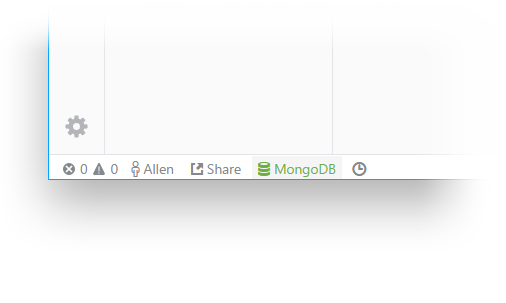
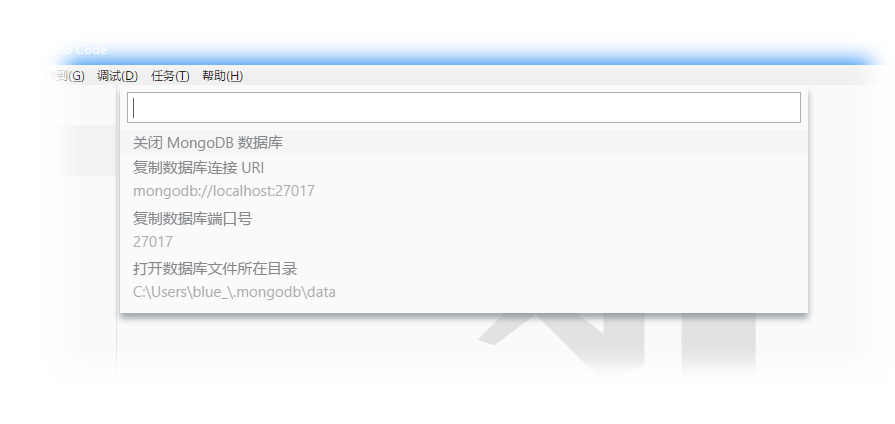

# Auto MongoDB

&#x1F44B; 免去寻找下载资源，安装，配置 MongoDB 数据库的繁琐步骤  
&#x2728; 打开编辑器，一次点击，即可自动下载安装配置运行 MongoDB 数据库

> &#x26A0; **请留意：** 我们使用 Sentry 记录插件错误日志，错误信息会自动发给开发者以解决问题。请放心，错误信息中不含有您的任何个人信息。如果您不期望我们这么做，后续版本中将会加入反馈信息的开关。有了您的支持与反馈我们才能做的更好，也非常欢迎您到[GitHub Issue](https://github.com/BlueSky1997AL/mongodb-vscode-ext/issues)中提交反馈。

## 开始

在 VSCode 中搜索并安装插件后，重载窗口，点击编辑器左下角状态栏 MongoDB 图标即可  
等待下载安装完成后，图标变为绿色即可连接使用数据库 &#x1F680;  
> &#x1F340; Tips: 状态栏图标为非绿色时，表示数据库未启动

再次单击绿色的数据库图标即可显示相关数据库的操作菜单，如下图

## 特征

  + 一次下载即可使用
  + 一键式简易操作，编辑器状态栏直观显示数据库运行状态
  + 支持自定义配置（下一版本将会包含），包括：
    - 二进制文件及数据库文件的存放路径
    - 数据库版本，平台，架构等
    - 数据库运行端口，运行模式等
    - 调试状态
  + 几乎支持所有平台：macOS / Linux / Windows

  > &#x1F43E; Tips：二进制及数据库文件默认存储位置为：`~/.mongodb`

## 要求

  + VSCode 版本不低于 1.23.0

## 插件配置项

  + 暂无（后续加入）

## 已知问题

  + 开启多个编辑器窗口时，主窗口可以正常对插件进行操作，其他窗口失效
  + 如果系统中存在已安装的 MongoDB，插件可能会出错（行为异常）

## ToDos

  + 解决开启多个编辑器窗口时出现的问题
  + 加入自定义配置功能
  + 添加错误信息反馈开关

## 发布日志

我们正在努力修复问题并增添新的功能，欢迎到我的[GitHub Issue页](https://github.com/BlueSky1997AL/mongodb-vscode-ext/issues)提出反馈和建议

### 0.0.1

  + 初始发布版本

## 其他

  + [GitHub 仓库](https://github.com/BlueSky1997AL/mongodb-vscode-ext)

-----------------------------------------------------------------------------------------------------------

**希望你能喜欢它!&#x1F60A;**
